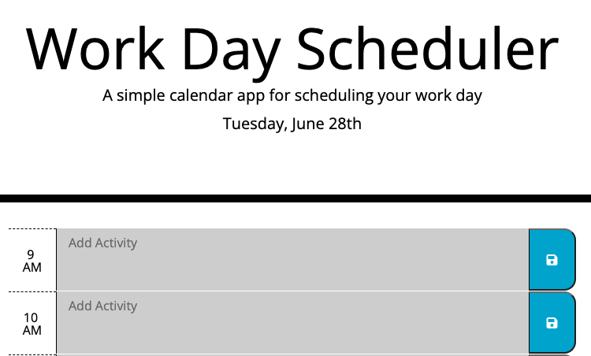

# Workday Calendar
## Description
Daily work planner that keeps track of the hour

On the project learning: 
* Accessing HTML elements through JQuery
* Continual testing for accurate deployment
* setInterval to check the hour
* Local Storage usage  

Challenges:
* Using a new icon library
* DOM manipulation with JQuery to get the correct element
* Moment.js to compare time

## Built With
* Javascript, JQuery, CSS, HTML
 

## Website
Visit the [project](https://violanerd.github.io/my-work-day/)

## Contribution

Developed by Madalyne Cross